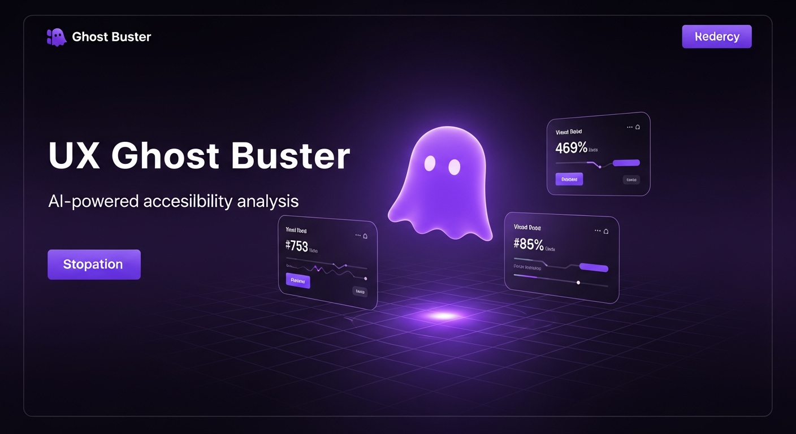
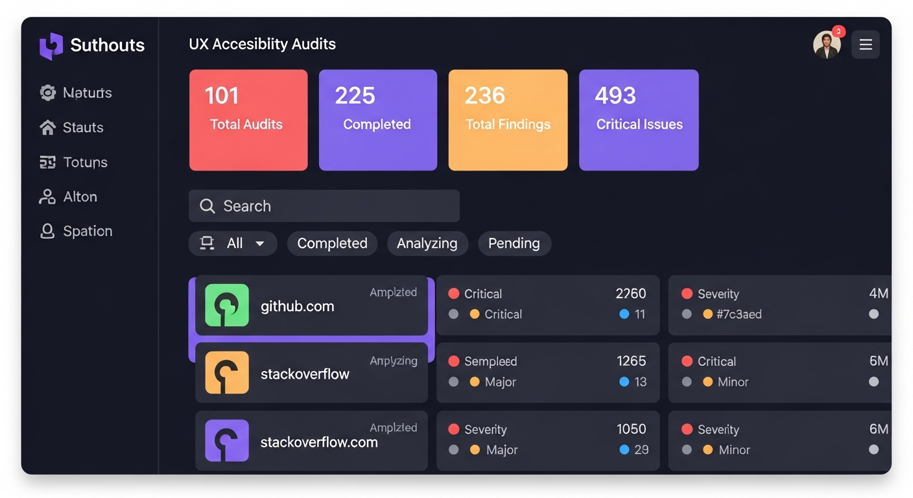
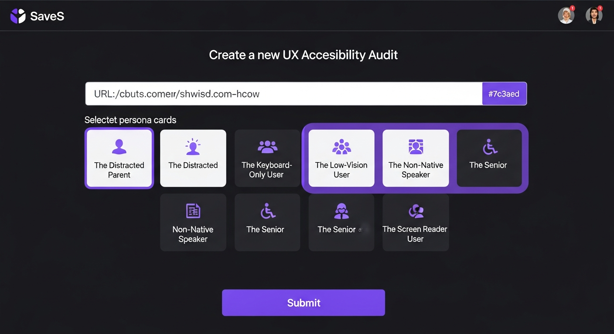
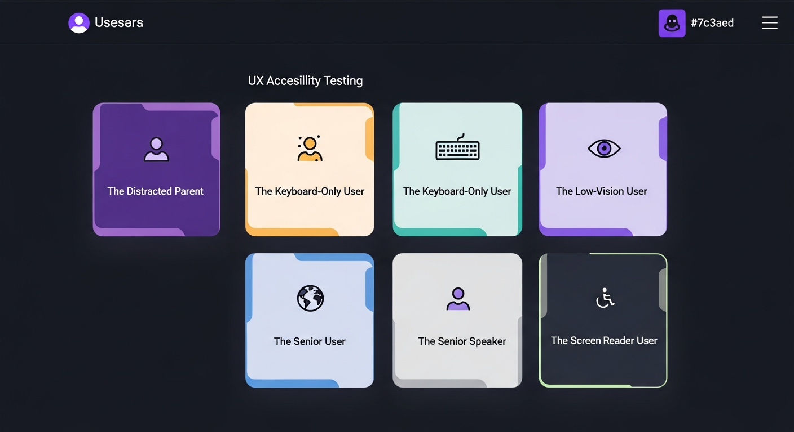
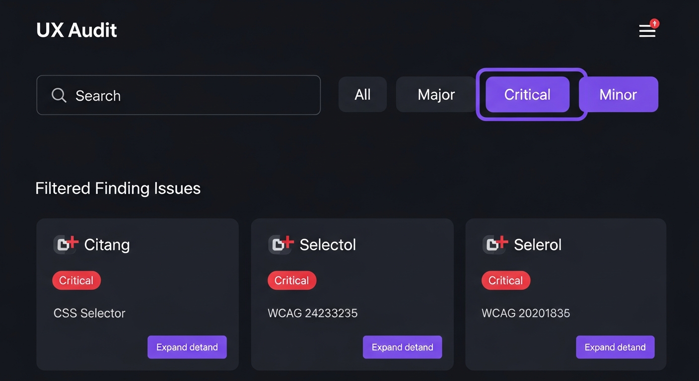
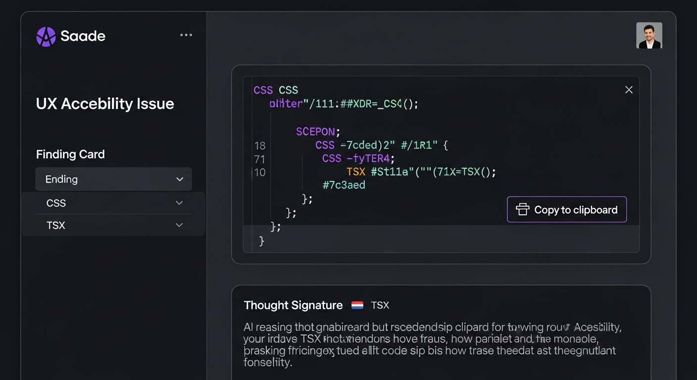
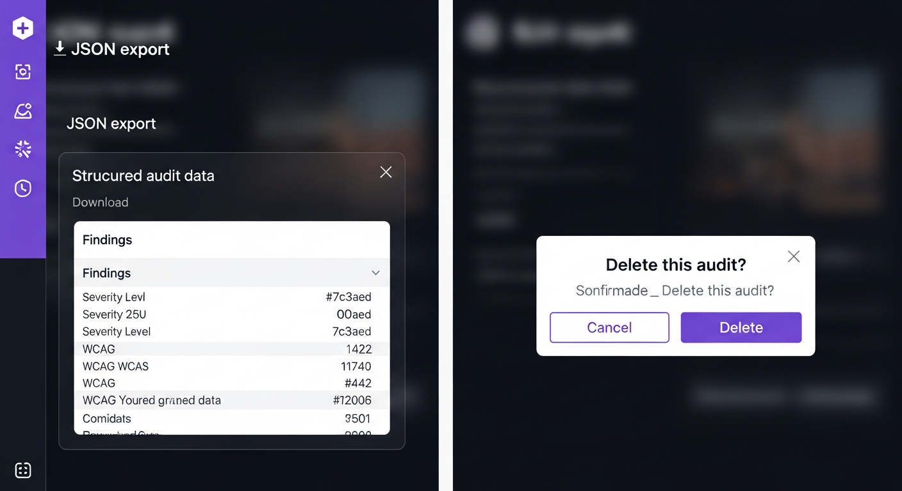

<div align="center">

# UX Ghost Buster

### AI-Powered UX Accessibility Auditor

_Analyze websites through the eyes of diverse user personas — uncover hidden UX barriers with AI-driven insights, remediation code, and detailed reasoning logs._



[](https://react.dev)
[](https://expressjs.com)
[](https://postgresql.org)
[](https://ai.google.dev)
[](https://typescriptlang.org)
[](https://tailwindcss.com)

</div>

---

## The Problem

Accessibility audits are typically one-dimensional — a single checklist run through automated tools. But real users are diverse. A distracted parent multitasking on mobile, a keyboard-only power user, a senior citizen unfamiliar with modern UI patterns — each experiences your site differently. Traditional tools miss these human-centered perspectives entirely.

## The Solution

**UX Ghost Buster** deploys AI-powered "ghost" personas that analyze your website from unique human perspectives. Each persona identifies UX barriers specific to their context, generates ready-to-use remediation code, and provides transparent AI reasoning ("Thought Signatures") so you understand *why* something is an issue.

---

## Features at a Glance

| Feature | Description |
|---------|-------------|
| **Multi-Persona Analysis** | 6 distinct user personas audit your site simultaneously |
| **AI-Powered Findings** | Gemini AI streaming identifies real UX barriers with WCAG references |
| **Code Remediation** | Ready-to-use CSS and TSX fix snippets for every issue found |
| **Thought Signatures** | Transparent AI reasoning logs explain the "why" behind each finding |
| **Severity Classification** | Critical / Major / Minor severity levels with visual indicators |
| **Advanced Filtering** | Search findings by text, filter by severity, browse by persona |
| **One-Click Export** | Download complete audit reports as structured JSON |
| **Re-Audit Workflow** | Re-run audits with the same URL and personas in one click |
| **Dark/Light Mode** | Full theme support with a ghost-inspired dark aesthetic |

---

## App Walkthrough

### Landing Page

A polished landing page introduces the product with an animated hero section, step-by-step "How It Works" guide, persona showcase, feature grid, FAQ accordion, and footer.


---

### Dashboard

The command center for all your audits. At-a-glance stats show total audits, completion rates, finding counts, and critical issues. Search audits by URL and filter by status (All / Completed / Analyzing / Pending).



**Key capabilities:**
- Real-time stat cards with total audits, completed count, findings, and critical issues
- URL search with instant filtering
- Status filter buttons (All / Completed / Analyzing / Pending)
- Per-audit delete with confirmation dialog
- Click any audit card to view full details

---

### Create a New Audit

Enter any website URL and select from 6 diverse user personas. The system normalizes URLs automatically and validates input before submission.



---

### Ghost Personas

Each persona represents a real-world user archetype with unique accessibility challenges:



| Persona | Focus Area |
|---------|-----------|
| **The Distracted Parent** | Mobile usability, cognitive load, interruption recovery |
| **The Keyboard-Only User** | Tab navigation, focus indicators, keyboard shortcuts |
| **The Low-Vision User** | Color contrast, text scaling, screen magnification |
| **The Non-Native Speaker** | Language clarity, iconography, cultural assumptions |
| **The Senior User** | Touch targets, cognitive complexity, familiar patterns |
| **The Screen Reader User** | ARIA labels, heading structure, semantic HTML |

---

### Audit Detail View

The full audit breakdown organized by persona. Each persona tab shows its findings with severity badges, WCAG criteria references, element selectors, and expandable remediation code.


**Header actions:**
- **Re-Audit** — Re-run the same audit with pre-filled URL and personas
- **Export** — Download the complete report as structured JSON
- **Delete** — Remove the audit with confirmation dialog

**Severity overview cards** show at-a-glance counts for Critical, Major, and Minor issues.

---

### Severity Filters & Search

Drill down into findings with text search and severity filters. Search across descriptions, categories, and CSS selectors. Filter by Critical, Major, or Minor to focus on what matters most.



---

### Code Remediation & Thought Signatures

Every finding includes AI-generated fix code (CSS and/or TSX) with one-click copy to clipboard. The "Thought Signature" section reveals the AI's reasoning process — why it flagged the issue and how the fix addresses it.



**Remediation features:**
- Language-tagged code blocks (CSS / TSX)
- Copy-to-clipboard with visual confirmation
- AI reasoning log explaining the "why" behind each finding
- WCAG criteria reference for compliance tracking

---

### Export & Data Management

Export complete audit reports as structured JSON for integration with other tools. Delete audits with cascading cleanup — all sessions, findings, and remediations are removed safely.



---

## Extended Analysis Sections

Each audit detail page includes additional context sections:

- **Category Breakdown** — Visual distribution of findings across categories (Navigation, Color Contrast, Typography, etc.)
- **WCAG References** — All referenced WCAG success criteria with descriptions
- **Audit Summary** — Overview stats including total findings, severity distribution, and personas analyzed
- **Recommendations** — Prioritized action items based on severity and impact

---

## Tech Stack

| Layer | Technology |
|-------|-----------|
| **Frontend** | React 18, Vite, TypeScript, Tailwind CSS, Shadcn UI, Framer Motion |
| **Backend** | Express.js, Drizzle ORM, PostgreSQL |
| **AI Engine** | Google Gemini (Streaming API via @google/genai) |
| **Routing** | wouter (client-side) |
| **State** | TanStack React Query v5 |
| **Validation** | Zod + drizzle-zod |
| **Design** | Dark mode default, purple primary (#7c3aed), Inter font family |

---

## Database Schema

```
audits
├── id (serial, PK)
├── targetUrl (text)
├── status (text: pending | analyzing | completed)
├── totalFindings, criticalCount, majorCount, minorCount (integer)
├── reasoningLog (text) — AI Thought Signatures
└── createdAt (timestamp)

ghost_sessions (CASCADE on audit delete)
├── id (serial, PK)
├── auditId (FK → audits)
├── personaName, personaDescription (text)
└── status (text)

findings (CASCADE on audit delete)
├── id (serial, PK)
├── sessionId (FK → ghost_sessions)
├── auditId (FK → audits)
├── severity (text: critical | major | minor)
├── category, title, description (text)
├── elementSelector, wcagCriteria (text)
└── createdAt (timestamp)

remediations (CASCADE on audit delete)
├── id (serial, PK)
├── findingId (FK → findings)
├── language (text: css | tsx)
├── code (text)
└── explanation (text)
```

---

## API Reference

| Method | Endpoint | Description |
|--------|----------|-------------|
| `GET` | `/api/audits` | List all audits |
| `GET` | `/api/audits/:id` | Get single audit |
| `POST` | `/api/audits` | Create audit (triggers AI analysis) |
| `DELETE` | `/api/audits/:id` | Delete audit with cascade cleanup |
| `GET` | `/api/audits/:id/sessions` | Get ghost sessions for audit |
| `GET` | `/api/audits/:id/findings` | Get findings for audit |
| `GET` | `/api/audits/:id/remediations` | Get remediations for audit |
| `GET` | `/api/audits/:id/export` | Export full audit report as JSON |

---

## Getting Started

```bash
# Install dependencies
npm install

# Push database schema
npm run db:push

# Start development server (frontend + backend on port 5000)
npm run dev
```

**Environment Variables:**
- `DATABASE_URL` — PostgreSQL connection string (auto-configured on Replit)
- `SESSION_SECRET` — Session signing key
- Gemini AI keys are managed through Replit AI Integrations

---

## Design Philosophy

- **Dark-first aesthetic** with full light mode support
- **Ghost/cyberpunk visual language** using purple (#7c3aed) as the primary accent
- **Information density** balanced with clear visual hierarchy
- **Framer Motion animations** for smooth page transitions and micro-interactions
- **Global Error Boundary** for graceful crash recovery
- **Optimistic UI updates** via React Query mutations for responsive interactions

---

<div align="center">

_Built with Replit Agent_

**UX Ghost Buster** — Because every user deserves a seamless experience.

</div>
